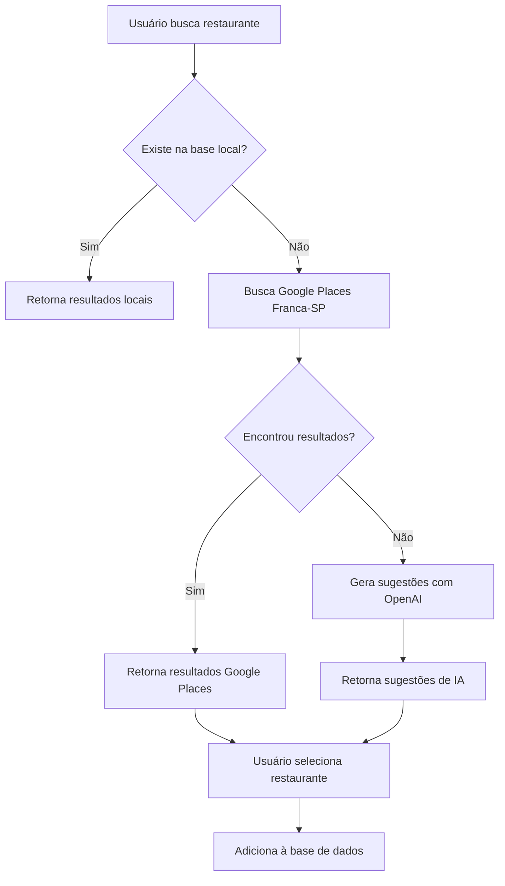

# 🤖 Sistema de IA para Busca de Restaurantes

## Visão Geral

O sistema de IA para busca de restaurantes foi desenvolvido especificamente para descobrir e adicionar novos estabelecimentos gastronômicos na cidade de **Franca-SP**. O foco são:

- 🍽️ **Restaurantes**
- 🍺 **Bares** 
- 🥪 **Lanchonetes**
- 🥖 **Padarias**

## Como Funciona

### 1. Fluxo de Busca Inteligente



### 2. Fontes de Dados

1. **Base Local (Prioridade 1)**
   - Restaurantes já cadastrados no sistema
   - Dados do Google Places importados previamente

2. **Google Places API (Prioridade 2)**
   - Busca em tempo real em Franca-SP
   - Raio de 15km da cidade
   - Filtrado por tipos específicos

3. **OpenAI GPT-3.5 (Prioridade 3)**
   - Sugestões inteligentes baseadas no termo buscado
   - Conhecimento local de Franca-SP
   - Nomes e tipos realistas

## Endpoints da API

### 🔍 Busca Inteligente
```http
GET /api/ai-restaurant-search/search
```

**Parâmetros:**
- `q` (string): Termo de busca
- `lat` (number): Latitude (opcional, default: Franca-SP)
- `lng` (number): Longitude (opcional, default: Franca-SP)
- `city` (string): Cidade (opcional, default: Franca)

**Exemplo:**
```bash
curl "http://localhost:5000/api/ai-restaurant-search/search?q=pizzaria"
```

**Resposta:**
```json
{
  "searchTerm": "pizzaria",
  "location": "Franca-SP",
  "found_in_local": false,
  "sources_used": ["google_places_api_franca", "openai_suggestions_franca"],
  "suggestions": [
    {
      "source": "google_places_api_franca",
      "place_id": "ChIJ...",
      "name": "Pizzaria Bella Massa",
      "address": "Rua Major Claudiano, 123 - Centro, Franca - SP",
      "city": "Franca",
      "state": "SP",
      "latitude": -20.5386,
      "longitude": -47.4008,
      "rating": 4.2,
      "user_ratings_total": 156,
      "cuisine_type": "Pizzaria",
      "confidence_score": 0.85,
      "is_franca_sp": true
    }
  ],
  "total_suggestions": 1
}
```

### ➕ Adicionar Restaurante
```http
POST /api/ai-restaurant-search/add-restaurant
Authorization: Bearer <token>
```

**Body:**
```json
{
  "name": "Pizzaria Bella Massa",
  "description": "Pizzaria tradicional em Franca-SP",
  "address": "Rua Major Claudiano, 123 - Centro, Franca - SP",
  "latitude": -20.5386,
  "longitude": -47.4008,
  "cuisine_type": "Pizzaria",
  "price_level": 3,
  "phone_number": "(16) 3722-1234",
  "website": "https://example.com",
  "external_id": "ChIJ...",
  "source": "google_places_api_franca"
}
```

**Resposta:**
```json
{
  "message": "Restaurante adicionado com sucesso",
  "restaurant": {
    "id": 123,
    "name": "Pizzaria Bella Massa",
    "description": "Pizzaria tradicional em Franca-SP",
    "address": "Rua Major Claudiano, 123 - Centro, Franca - SP",
    "created_by": 1,
    "created_at": "2024-01-15T10:30:00Z"
  },
  "source": "google_places_api_franca",
  "added_by": 1
}
```

### 📊 Estatísticas
```http
GET /api/ai-restaurant-search/stats
Authorization: Bearer <token>
```

**Resposta:**
```json
{
  "statistics": {
    "total_ai_restaurants": 25,
    "added_last_30_days": 8,
    "added_last_7_days": 3,
    "avg_rating_ai_restaurants": 4.2
  },
  "sources": [
    {
      "source": "google_places_api_franca",
      "count": 15
    },
    {
      "source": "openai_suggestions_franca",
      "count": 10
    }
  ]
}
```

## Interface do Usuário

### Integração na Página de Restaurantes

1. **Botão "Busca IA"** - Abre modal de busca inteligente
2. **Busca Automática** - Quando não encontra resultados locais, sugere busca por IA
3. **Modal Interativo** - Interface completa para buscar e adicionar restaurantes

### Componente AIRestaurantSearch

```jsx
<AIRestaurantSearch
  show={showAISearch}
  onClose={() => setShowAISearch(false)}
  onRestaurantAdded={handleAIRestaurantAdded}
/>
```

## Configuração

### Variáveis de Ambiente

```env
# OpenAI API (opcional)
OPENAI_API_KEY=sk-...

# Google Places API (opcional)
GOOGLE_PLACES_API_KEY=AIza...

# Base de dados
DB_HOST=localhost
DB_NAME=beastfood
DB_USER=postgres
DB_PASSWORD=...
```

### Instalação de Dependências

```bash
# Backend
npm install axios

# Frontend  
npm install axios react-icons
```

## Tipos de Estabelecimentos Suportados

### Categorias Principais
- **Restaurante** - Estabelecimentos de refeições completas
- **Bar** - Bares e pubs
- **Lanchonete** - Fast food e lanches
- **Padaria** - Padarias e confeitarias

### Tipos de Culinária
- Italiana, Japonesa, Brasileira, Chinesa
- Mexicana, Francesa, Indiana, Tailandesa
- Árabe, Vegetariana, Pizza, Churrasco
- Fast Food, Frutos do Mar

## Score de Confiança

O sistema calcula um score de confiança (0-1) baseado em:

- **Fonte dos dados** (0.4 para base local, 0.3 para Google Places, 0.2 para IA)
- **Rating do estabelecimento** (+0.2 se rating > 3.5)
- **Número de avaliações** (+0.1 se > 20 avaliações para Franca)
- **Localização confirmada** (+0.15 se em Franca-SP)
- **Tipo válido** (+0.1 se é restaurante/bar/lanchonete/padaria)

## Tratamento de Erros

### Erros Comuns
- **400**: Termo de busca muito curto (< 2 caracteres)
- **401**: Token de autenticação inválido/ausente
- **409**: Restaurante já existe na base
- **500**: Erro interno (API externa indisponível)

### Fallbacks
1. Se Google Places falha → Usa apenas OpenAI
2. Se OpenAI falha → Usa apenas Google Places
3. Se ambos falham → Retorna erro amigável

## Teste da Implementação

### Arquivo de Teste
Execute o arquivo `test_ai_restaurant_search.html` para testar:

1. **Busca Inteligente** - Teste com diferentes termos
2. **Adição de Restaurantes** - Simule inserção na base
3. **Estatísticas** - Visualize dados do sistema

### Comandos de Teste

```bash
# Testar busca
curl "http://localhost:5000/api/ai-restaurant-search/search?q=hamburguer"

# Testar adição (com token)
curl -X POST "http://localhost:5000/api/ai-restaurant-search/add-restaurant" \
  -H "Authorization: Bearer <seu-token>" \
  -H "Content-Type: application/json" \
  -d '{"name":"Teste Burger","address":"Centro, Franca-SP"}'

# Testar estatísticas
curl "http://localhost:5000/api/ai-restaurant-search/stats" \
  -H "Authorization: Bearer <seu-token>"
```

## Monitoramento

### Logs do Sistema
```bash
🤖 Iniciando busca com IA para: pizzaria em Franca-SP
✅ Busca IA concluída para Franca-SP. 3 sugestões encontradas de: google_places_api_franca
✅ Novo restaurante adicionado via IA: Pizzaria Bella Massa (ID: 123) por usuário 1
```

### Métricas Importantes
- Número de buscas por IA vs. busca local
- Taxa de conversão (sugestões → adições)
- Qualidade das sugestões (ratings médios)
- Cobertura geográfica em Franca-SP

## Limitações e Considerações

### Limitações Atuais
- Focado apenas em Franca-SP
- Dependente de APIs externas (Google Places, OpenAI)
- Requer autenticação para adicionar restaurantes

### Futuras Melhorias
- Expandir para outras cidades
- Adicionar fotos dos estabelecimentos
- Implementar validação por crowdsourcing
- Cache inteligente para reduzir custos de API

---

**🚀 Sistema implementado e testado!** 

Para dúvidas ou melhorias, consulte a documentação técnica ou abra uma issue no repositório.


